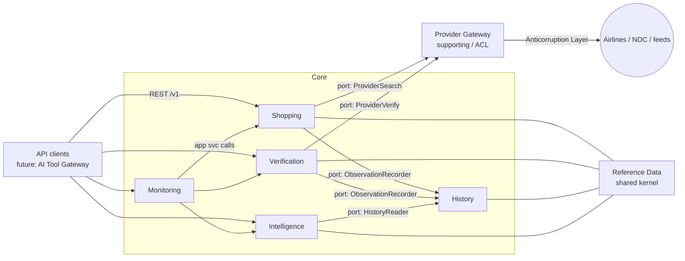
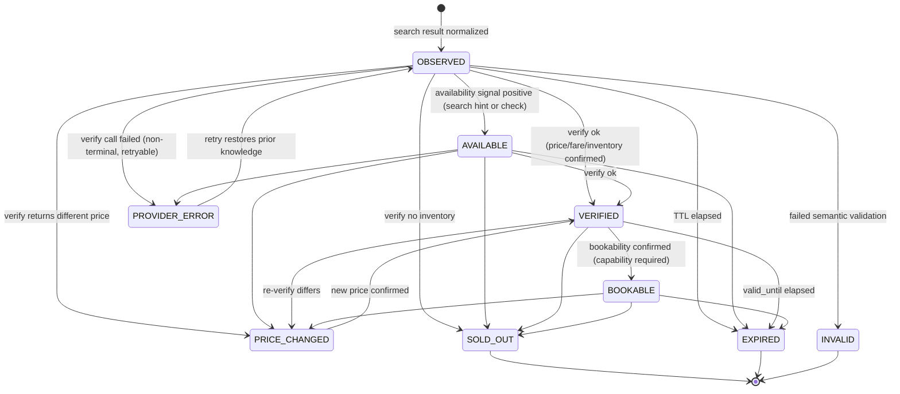
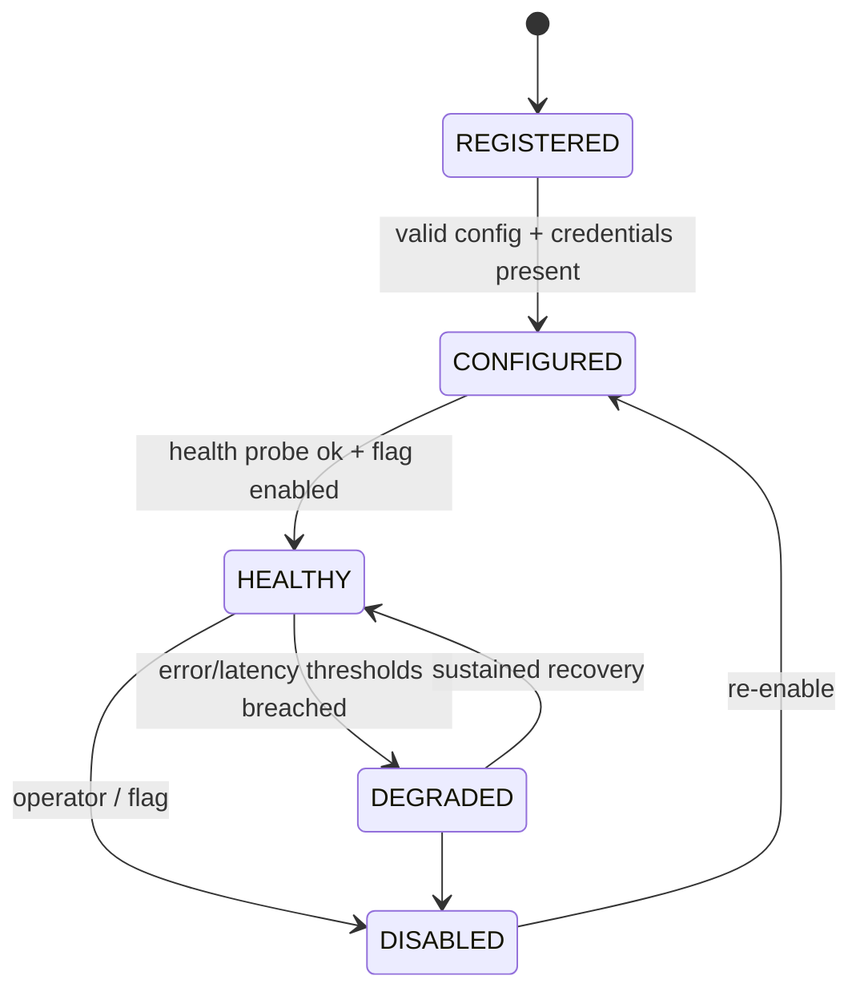
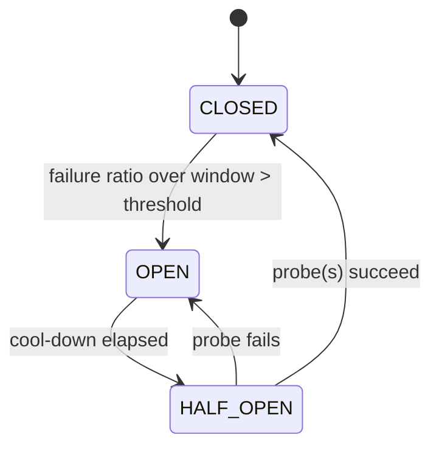

# 02 — Domain: Principles, Glossary, Bounded Contexts, Model, State Machines

## 1. Architecture principles (Constitution §6, restated as testable rules)

| ID | Principle | How it is enforced |
|----|-----------|--------------------|
| P1 | Domain first | `domain/` packages import only stdlib + `internal/shared`; checked by import-rule lint in CI |
| P2 | Provider independence | Provider types live only under `internal/provider/connectors/<name>`; mapping to canonical at that boundary |
| P3 | Explicit boundaries | Contexts talk through `ports` interfaces or application services; no cross-context table access |
| P4 | Immutable history | No UPDATE/DELETE grants on observation tables for app role; corrections append |
| P5 | Verification explicit | Offer status transitions only through the verification application service |
| P6 | Secure by default | Security requirements are part of Definition of Done |
| P7 | Observable by default | Middleware + provider gateway emit traces/metrics; missing instrumentation fails review |
| P8 | Failure isolation | Per-provider bulkhead, timeout, breaker; partial-result search |
| P9 | Deterministic before AI | Analytics are SQL/Go first; ML only after data volume justifies |
| P10 | API first | OpenAPI is the contract; code conforms, CI diffs |
| P11 | Backward compatibility | oasdiff-style breaking-change check in CI |
| P12 | Infrastructure simplicity | New infra requires ADR with measured justification |
| P13 | Evolution over distribution | Modular monolith; extraction criteria in ADR-001 |
| P14 | Explicit tech debt | `docs/roadmap/tech-debt.md` register (created on first debt item) |
| P15 | ADR per architectural decision | PR template checklist |

## 2. Domain glossary (ubiquitous language)

| Term | Definition |
|------|-----------|
| **Provider** | An authorized channel to airline inventory (airline API, NDC endpoint, authorized feed). Not a business partner entity. |
| **Connector** | Code adapter implementing provider capabilities and mapping to canonical types. |
| **Provider Gateway** | Platform component applying routing, auth, timeout, retry, rate limit, breaker, health, error translation around connectors. |
| **Search request** | Query for offers: itinerary shape, dates, passengers, cabin. |
| **Provider offer** | Raw, provider-native offer representation. Never leaves the connector. |
| **Offer (FlightOffer)** | Canonical offer: itinerary + fare + price + availability, with internal `OfferID`. |
| **Itinerary** | Ordered slices (outbound/return) of segments. |
| **Segment** | One flight leg: marketing/operating carrier, flight number, airports, departure/arrival. |
| **Itinerary fingerprint** | Deterministic hash of physical itinerary (segments, operating carrier, times). |
| **Offer fingerprint** | Itinerary fingerprint + fare characteristics + cabin; identifies a purchasable product shape. |
| **Observation** | Immutable record of what a provider said at a time (price and/or availability). |
| **Observed price** | Price seen in search/response. Not a promise. |
| **Verification** | An explicit provider interaction attempting to confirm existence, inventory, fare, price, bookability. |
| **Verified price** | Price returned by verification at `verified_at`. Has a TTL (`valid_until`) when provider supplies one. |
| **Bookable** | Verified AND the supported channel confirms it can currently be purchased/reserved. Capability-gated (INV-12). |
| **Quarantine** | Store for records failing validation/quality thresholds; kept for diagnosis, excluded from analytics. |
| **Route** | Origin–destination airport (or city) pair, directional. |
| **Opportunity** | A verified offer whose price is notable vs history under a versioned rule/model, with reason codes. |
| **Monitoring target** | Configured route/date window to be re-observed on a schedule tier. |
| **Alert** | Client-defined condition on a monitoring target; fires only when satisfied by verified data. |
| **Lineage** | Provenance chain: source → provider request → raw ref → normalization version → verification. |
| **Tool Gateway** | Future boundary through which an LLM calls platform capabilities under a policy engine. |

## 3. Bounded contexts

### Implemented in Phase 1

| Context | Responsibilities | Owns (data) | Depends on |
|---------|------------------|-------------|-----------|
| **Flight Shopping** (`shopping`) | Search orchestration, provider selection, aggregation, dedup, ranking | `flight_offers`, `flight_segments`, `search_requests` | Provider (port), History (`ObservationRecorder` port) |
| **Offer Verification** (`verification`) | Verification state machine, availability/fare/price/bookability checks | `offer_verifications`, `offer_status_events` | Provider (port), History (port) |
| **Flight History** (`history`) | Immutable observations, lineage, historical queries, quarantine | `price_observations`, `availability_observations`, `quarantined_records` | none (downstream of everything else) |
| **Flight Intelligence** (`intelligence`) | Statistics, trends, opportunity detection; later anomaly/forecast | `route_statistics` (derived), `opportunities` | History (read port) |
| **Monitoring** (`monitoring`) | Targets, scheduling tiers, alerts, evaluation, notifications | `monitoring_targets`, `alerts`, `alert_events` | Shopping, Verification, Intelligence (ports), Notification (port) |
| **Provider** (`provider`) (supporting) | Gateway, registry, resilience, connectors, provider health | `providers`, `provider_requests`, `provider_config` | none; implements ports consumed by others |
| **Reference Data** (inside `shared` kernel or small context) | Airlines, airports, routes | `airlines`, `airports`, `routes` | none |

### Reserved (no code yet; boundary only)

Identity, Customers, Orders, Payments, Ticketing, Servicing, Travel Planning, Hotels, Car Rental,
Insurance, Activities, Notifications (a port exists in Monitoring; adapter-only until extracted),
Billing, Support, AI Tool Gateway.

Rule: a reserved context may not be imported into Phase 1 packages. Verified offers (`OfferID`) are the
single integration seam to future Orders.

## 4. Context map



Relationships: Provider is an **Anticorruption Layer** to external systems. History is **upstream
(conformist-free, open host)** for Intelligence. Reference Data is a **shared kernel** kept intentionally
tiny. Monitoring is a **customer** of Shopping/Verification/Intelligence via application-layer ports.

## 5. Domain model

### Value objects (no primitive obsession)

`Money{AmountMinor int64, Currency ISO4217}`, `AirportCode` (IATA 3), `AirlineCode` (IATA 2 / ICAO 3),
`FlightNumber`, `Route{Origin, Destination}`, `OfferID` (internal, opaque, ULID/UUIDv7),
`ProviderOfferRef{ProviderID, ExternalID}`, `DateRange`, `PassengerCount{Adults, Children, Infants}`,
`CabinClass`, `ItineraryFingerprint`, `OfferFingerprint`, `ObservedAt`, `QualityScore`.

### Aggregates

- **FlightOffer** (root): `OfferID`, `Itinerary` (slices→segments), `Fare` (cabin, brand, baggage flags as provider-declared), `Price` (observed Money), `Availability` (seats hint, tri-state), `Provider ref`, `Fingerprints`, `Status` (derived from last transition), `ObservedAt`.
  Invariants: segments continuous in airports and time order; arrival after departure; currency valid; price > 0; positive plausible duration.
- **Verification** (root): `VerificationID`, `OfferID`, four facts each `Yes|No|Unknown`:
  `FlightExists`, `InventoryAvailable`, `FareAvailable`, `Bookable` + `VerifiedPrice?` + `VerifiedAt` + `ValidUntil?` + `ProviderRequestRef`.
- **Observation** (immutable record, not an aggregate with behavior): price or availability, lineage fields.
- **MonitoringTarget**, **Alert** (root with condition + status).
- **Opportunity**: score, features (JSON), reason codes, calculation_version, model_version, linked verification.

### Domain services / application services

`SearchService` (orchestrate), `Deduplicator`, `Ranker` (versioned), `VerificationService`,
`ObservationRecorder`, `StatisticsCalculator`, `OpportunityEvaluator`, `MonitoringScheduler`,
`AlertEvaluator`.

### Capability-gated verification (resolves INV-12)

```
Provider capabilities (declared, not assumed):
  supports_search, supports_price_confirm, supports_inventory_check, supports_bookability_check
Max reachable offer state per provider = f(capabilities)
  only search            -> OBSERVED / AVAILABLE(hint)
  + price/inventory conf -> VERIFIED
  + bookability check    -> BOOKABLE
```

## 6. State machines

### 6.1 Offer (modeled as an append-only `offer_status_events` log; "current status" is the latest event)



Rules: `PRICE_CHANGED` carries both prices; the new price is a *new observation + verification*, never an
overwrite (INV-3). `PROVIDER_ERROR` is a transient annotation; it never erases a prior VERIFIED fact,
which still decays by TTL. Every transition records actor (`search|verify|ttl|system`), provider request
ref, and timestamp. Illegal transitions are rejected in the domain (table-driven test covers all pairs).

### 6.2 Provider



### 6.3 Circuit breaker (per provider, per operation)



### 6.4 Future Order (reserved; do not implement)

`CREATED → PENDING_PAYMENT → PAID → TICKETED`, with `CANCELLED` and `REFUNDED` branches. Entry
requires a `VERIFIED/BOOKABLE` OfferID that has not expired.

### 6.5 Alert

`ACTIVE → TRIGGERED → (ACTIVE | SNOOZED | EXPIRED) ; ACTIVE → PAUSED/DELETED`. Triggering is idempotent per
(alert, verified_offer, condition_version).

## 7. Deduplication model (resolves C15)

- Level 1 **itinerary fingerprint**: origin, destination, ordered (marketing+operating carrier, flight number, dep/arr UTC) per segment.
- Level 2 **offer fingerprint**: level 1 + cabin + fare brand/class + baggage inclusions.
- Same itinerary from multiple providers → one canonical itinerary with multiple offers (different fares/providers/prices). Same offer fingerprint across providers → one offer, with `sources[]` kept and best price selected by rule; all source observations remain stored.
