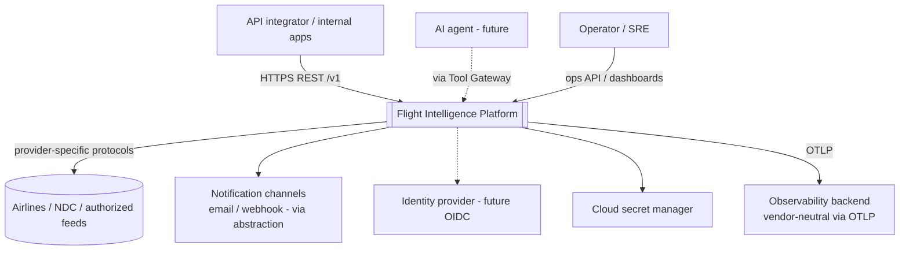
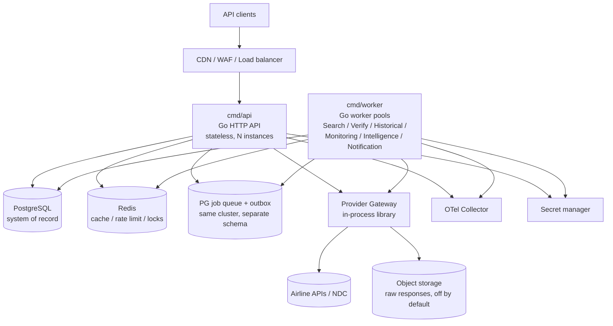
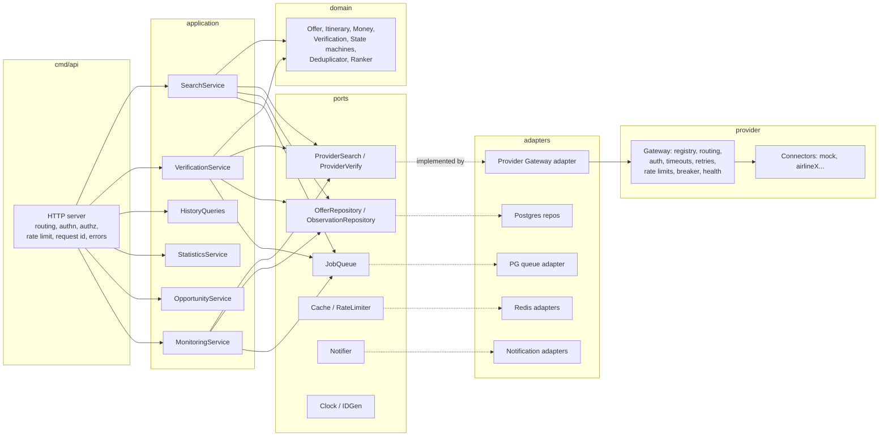
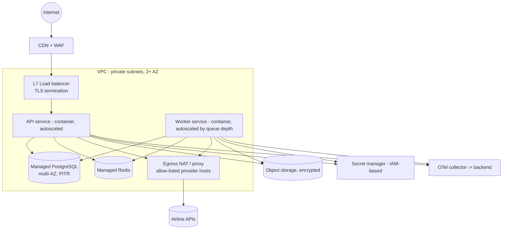
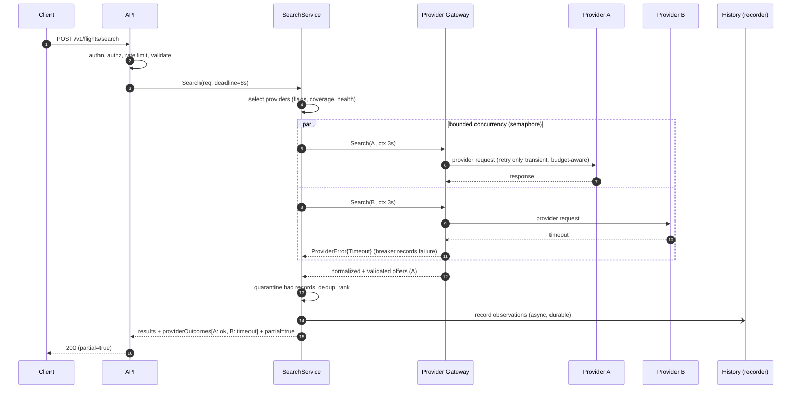
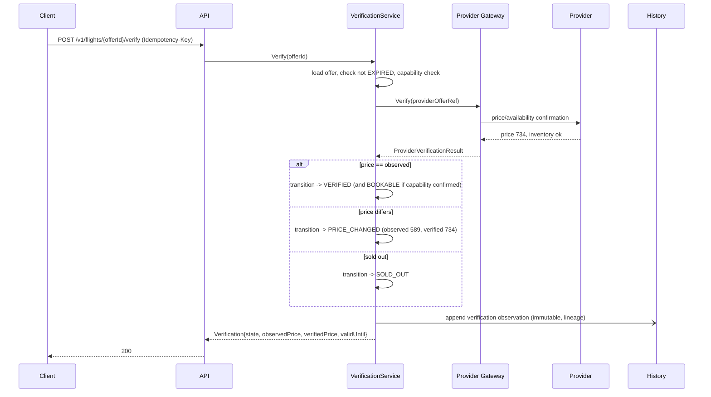
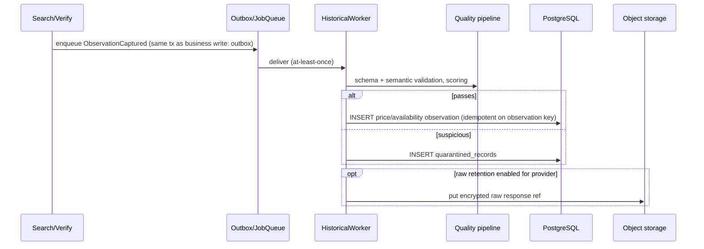
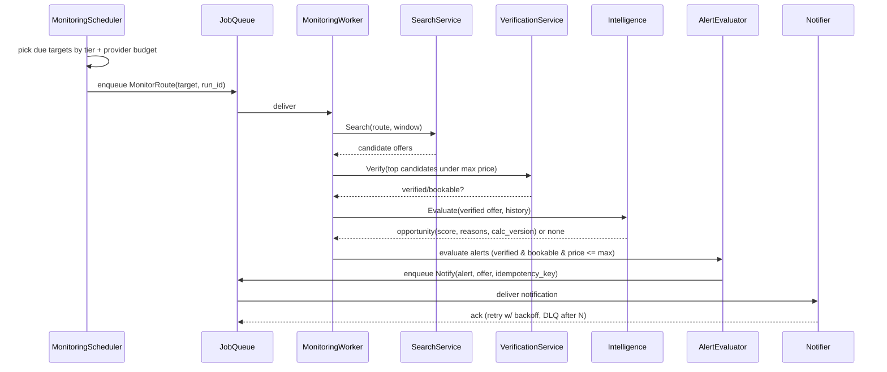
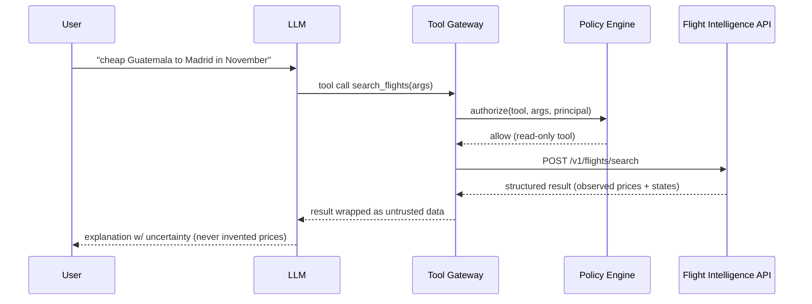

# 03 — System Architecture (C4, Deployment, Sequences, Events)

## 1. C1 — System context

## 2. C2 — Containers (initial: 2 deployable binaries + managed data stores)

Why two binaries: workers scale and fail independently of the request path (backpressure, deploy
cadence) at near-zero extra cost; the Provider Gateway stays an **in-process library** used by both
(no network hop, no extra service). Justification and extraction criteria: ADR-001, ADR-012.

## 3. C3 — Components (inside the monolith)

Dependency rule (enforced in CI): `domain` ← `application` ← `adapters`/`cmd`; `ports` defined by
`application` consumers; `provider/connectors/*` import nothing outside `provider` and `shared`.

## 4. Deployment architecture (TARGET, cloud-neutral — not built yet)

> **Local-first (D1, ADR-025):** today everything runs via Docker Compose on one machine (api, worker, postgres, redis, otel-collector, mock provider). The diagram below is the future deployed shape once a vendor is chosen; nothing in it is implemented or required now.

- Compute: managed container service (no Kubernetes; ADR-025). Environments: dev, staging, prod, each separate account/project/state.
- Egress allow-list for provider hosts mitigates SSRF/exfiltration (ADR-018, security doc).
- Release: CI → staging → smoke → canary/controlled prod → auto-rollback on SLO gate.

## 5. Sequence diagrams

### SD-1 Flight search (and SD-2 provider failure)

If *all* providers fail: `503 SEARCH_UNAVAILABLE` with per-provider outcomes. If none are applicable: `200` with empty results and `coverage: none`.

### SD-3 Offer verification and SD-4 price change

### SD-5 Historical observation

### SD-6 Scheduled monitoring, SD-7 opportunity detection, SD-8 alert delivery

Unverified anomalies stop at MW→V: they are recorded as observations/anomalies, never notified (INV-8).

### SD-9 AI search (Phase 2/3, reserved)

### SD-10 Future booking flow (reserved; outline only)

`Verified/Bookable OfferID → Order(CREATED) → explicit user confirmation → Payment → Ticketing → Servicing`.
Every step crosses a new bounded context; none exists in Phase 1. LLM tools `create_booking`, `pay` etc.
require out-of-band explicit confirmation (Constitution §42).

## 6. Event catalog (event-ready, not event-driven)

Phase 1 uses an **outbox table + PG job queue** for durable async work; events are internal
integration messages (JSON, versioned `type` + `schema_version`), idempotent consumers keyed by
`event_id`. No external broker (ADR-013, ADR-020).

| Event | Producer | Consumers | Notes |
|-------|----------|-----------|-------|
| `search.completed.v1` | shopping | history, monitoring metrics | includes per-provider outcomes |
| `observation.captured.v1` | shopping/verification | history worker | carries lineage + raw ref |
| `offer.status_changed.v1` | verification | monitoring, history | from→to, reasons |
| `verification.completed.v1` | verification | intelligence, monitoring | |
| `opportunity.detected.v1` | intelligence | monitoring | has reason codes, versions |
| `alert.triggered.v1` | monitoring | notification worker | idempotency key |
| `provider.health_changed.v1` | provider | monitoring, ops | state transitions |
| `quarantine.recorded.v1` | history | ops metrics | drift signal |

Reliability: at-least-once; DLQ after max attempts; replay tooling in ops runbook.
