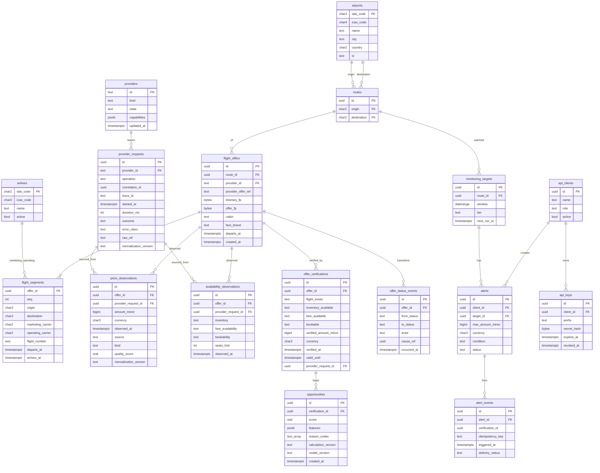

# 04 — Data: ERD, Contracts, Lineage, Quality, Retention, Classification, Privacy

Conventions: all timestamps `timestamptz` UTC; IDs are UUIDv7 (time-ordered) unless natural (IATA codes);
money = `amount_minor bigint` + `currency char(3)`; JSONB only for provider-variant or versioned
payloads (features, raw refs), never for core queryable attributes. Constitution §20 lists 8 initial
entities; the additions below are required to implement the stated invariants and are flagged **(+)**.

## 1. ERD (initial)



Additions beyond §20 **(+)**: `providers`, `offer_verifications`, `offer_status_events`, `opportunities`,
`quarantined_records`, `monitoring_targets`, `alerts`/`alert_events` (phase E8), `api_clients`/`api_keys`,
`outbox`, `jobs`, `feature_flags`. Rationale: INV-3/4/7/12, FR-07/12/15/17, ADR-013/020/024.

Other (+) tables (no diagram detail): `quarantined_records(id, provider_request_id, reason_codes, payload_ref,
created_at)`, `outbox(id, type, schema_version, payload, created_at, published_at)`,
`jobs(id, queue, payload, run_at, attempts, locked_by, locked_until, status, idempotency_key)`,
`feature_flags(key, owner, purpose, enabled, created_at, review_by)`.

## 2. Schema rules

- Observation tables: `INSERT`-only for the application role (no UPDATE/DELETE grant); migrations/retention jobs use a separate privileged role. Idempotency via unique `(provider_request_id, offer_id, kind)`.
- `flight_offers`/`flight_segments` are an *entity snapshot*; status lives in `offer_status_events` (current = latest event, materialized as a view or denormalized column maintained in the same transaction).
- `provider_offer_ref` is unique per `(provider_id, provider_offer_ref, created window)`; never used as `OfferID` (INV-6).
- Foreign keys on reference data; checks: `amount_minor > 0`, `arrives_at > departs_at`, enum checks via `CHECK` (not Postgres ENUM, to allow expand/contract).
- Migrations follow expand → deploy → backfill → switch → contract (ADR-015 / Constitution §54, §107). Tool choice recorded in ADR-003.

## 3. Index and partition policy

Indexes only from named query patterns. Initial candidates (validate with `EXPLAIN` on realistic data):

| Query | Index |
|-------|-------|
| Price history by route/time | `price_observations (route_id via offer, observed_at DESC)` — likely denormalize `route_id` + `departure_date` into observations |
| History for an offer | `price_observations (offer_id, observed_at DESC)` |
| Latest status of offer | `offer_status_events (offer_id, occurred_at DESC)` |
| Due monitoring targets | `monitoring_targets (next_run_at) WHERE active` |
| Job claim | `jobs (queue, run_at) WHERE status='ready'` + `FOR UPDATE SKIP LOCKED` |
| API key lookup | `api_keys (prefix)` unique |

Partitioning of observation tables by `observed_at` (monthly) only after measured need (R-10); schema
is partition-ready (observation key includes `observed_at`).

## 4. Data contracts

| Contract | Producer → Consumer | Format | Versioning |
|----------|--------------------|--------|-----------|
| Public API | platform → clients | OpenAPI 3.1 JSON | `/v1`, additive-only |
| Canonical model | connector → shopping/verification | Go types in `domain` + golden JSON fixtures | `normalization_version` string stored on every observation |
| Provider fixtures | provider docs → tests | JSON/XML files in `test/fixtures/providers/<name>/` | per provider |
| Internal events | producer → consumers | JSON + `type`, `schema_version` | additive within version; new version for breaking |
| Observation records | workers → history | DB schema | migrations |
| AI tool schemas (future) | Tool Gateway → LLM | JSON Schema derived from OpenAPI | follows API version |

## 5. Lineage

Every observation links: `provider_requests.id` (provider, operation, timestamps, outcome) →
`raw_ref` (object storage key, nullable) → `normalization_version` → `quality_score` +
quarantine decision → `offer_verifications` (if any). Query answering "where did this price come from?":
join observation → provider_request → verification. Exposed in API via `lineage` object on history rows
(P4/P7 personas), minus any provider-confidential fields.

## 6. Data quality pipeline

```
Provider response → schema validation → semantic validation → canonical mapping → quality score → persist | quarantine
```

Semantic checks: dep<arr; valid IATA/ICAO codes (reference data); valid ISO 4217; price > 0 and within
plausibility band for route (soft flag, not rejection); segment continuity (arr airport = next dep
airport; min connection time not violated per reference rule); duration plausibility; no duplicate
segments; valid dates (not in past). Outcome: `accept`, `accept_with_flags`, `quarantine`, `reject`
(schema-invalid). Thresholds are config, versioned, and exposed as metrics.

## 7. Retention

| Data | Retention (initial) | Notes |
|------|--------------------|-------|
| Raw provider responses | OFF by default; if enabled per provider: short (e.g. 7–30 days, per contract) | Encrypted, access-controlled, legal review (R-2) |
| Price/availability observations | Long-term (years); archive tiering later | Immutable |
| Verifications, status events | Long-term | audit value |
| Quarantined records | 90 days | diagnosis |
| Jobs / outbox published rows | 14 days | pruned |
| Application logs | 30 days hot | no secrets/PII |
| Audit logs (authn/z, admin actions, flag changes) | ≥ 1 year, immutable store | |
| API access logs | 90 days | |
| PII (future) | minimum necessary; deletion workflow | none collected in Phase 1 |

Values are proposals; final numbers need Legal/provider-contract input (open question D7).

## 8. Data classification

| Class | Examples | Controls |
|-------|----------|----------|
| **C4 Secret** | provider credentials, API key secrets, signing keys | SecretStore port only (local gitignored files now; cloud secret manager later), never logged, rotation |
| **C3 Confidential** | raw provider responses, provider contract terms, per-provider cost data, API key hashes | encrypted at rest, least-privilege, retention |
| **C2 Internal** | observations, verifications, opportunities, statistics, monitoring config | encrypted at rest/in transit, role-based access |
| **C1 Public-ish** | airline/airport reference data | no special handling |
| **PII (future C3)** | passenger names, contact, payment refs | not collected in Phase 1; separate context/store when added |

## 9. Privacy model

Privacy-by-design: collect no personal data in Phase 1 (clients are machine identities; alert
contact details, if any, arrive as opaque destination references owned by the client). Data
minimization, purpose limitation, retention, deletion hooks, audit. Before any PII (Identity,
Customers, Orders) a DPIA-style review and jurisdiction analysis (e.g. Guatemala, EU/US if serving
those users) is a gating task; no legal requirement is asserted here.
