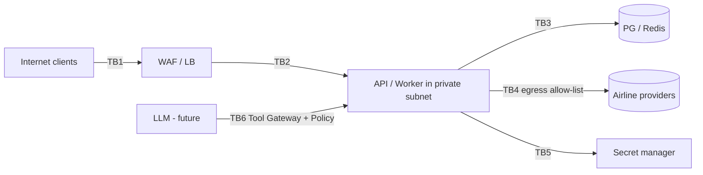

# Security Architecture, Requirements and Threat Model

Baselines: OWASP ASVS **5.0.0, Level 2 target** ([ADR-036](../adr/ADR-036-owasp-asvs-adoption.md); chapter map in
[asvs-coverage.md](asvs-coverage.md)), NIST SSDF, OWASP SAMM.
No regulatory claim is made here.

## 1. Security requirements

| ID | Requirement |
|----|-------------|
| SR-01 | All traffic TLS 1.2+ (1.3 preferred); HSTS; internal calls authenticated |
| SR-02 | API keys: ≥128-bit random secret, stored as hash (HMAC/argon-class), prefix for lookup, expiry + revocation, constant-time compare, never logged |
| SR-03 | AuthZ enforced server-side per endpoint via role + resource scoping (alerts scoped to client); deny by default |
| SR-04 | Input validation at the edge (schema from OpenAPI) and again in domain constructors; parameterized SQL only |
| SR-05 | Secrets only via the SecretStore port (local gitignored files now, cloud secret manager once a vendor is chosen); no secrets in git, images, IaC state in plaintext, logs, API responses; rotation runbook |
| SR-06 | Provider credentials isolated per provider; fetched with least-privilege IAM; short-lived where provider supports |
| SR-07 | Outbound egress allow-list to configured provider hosts only; connector HTTP clients cannot follow redirects to non-allow-listed hosts (SSRF) |
| SR-08 | Rate limiting per IP, API key, operation, provider; quotas separate for search vs verify |
| SR-09 | Structured logs with redaction middleware (denylist keys + pattern scan); never full provider payloads |
| SR-10 | Provider responses are untrusted: size caps, strict parsing, XML hardening (no external entities/DTD), timeouts, schema validation |
| SR-11 | Replay/abuse: idempotency keys, request-ID, optional signed requests for future high-trust clients |
| SR-12 | Audit log (authn/z decisions on privileged ops, flag/provider changes, key lifecycle) in append-only store |
| SR-13 | Supply chain: pinned deps, SBOM, vuln + secret + SAST + container + IaC scans, provenance, protected branches/runners |
| SR-14 | AI: LLM only via Tool Gateway + policy engine; provider/external text is untrusted data; transactional tools need explicit user confirmation |
| SR-15 | DB roles: separate migration/privileged vs app role; app role no UPDATE/DELETE on observation tables |
| SR-16 | Encryption at rest (DB, object storage, backups) with managed keys; object storage private, access via IAM |
| SR-17 | Containers: non-root, minimal/distroless base, read-only FS where possible, no secrets in env dumps |
| SR-18 | Public-repo hygiene (repo is MIT): `.gitignore` covers `.env*`, `secrets/`, `*.pem`, local data dirs; pre-commit + CI secret scan; provider contracts, credentials and licensed datasets are never committed; recorded fixtures only from public docs/sandboxes whose terms allow redistribution and are scrubbed |
| SR-19 | Environment guard: the `mock` connector and local SecretStore adapter fail startup when `APP_ENV` is production-like |
| SR-20 | Idempotency keys are scoped to (api_client, operation); the same key from another client never replays or leaks a stored result |
| SR-21 | Operator/admin endpoints (provider state, flags) are served on a separate internal listener, not the public API port, and require OPERATOR/ADMIN |
| SR-22 | Outbound HTTP: dial-time IP validation after DNS resolution (block loopback, link-local, private and metadata ranges unless explicitly allow-listed), no cross-host redirects, response size and time caps |
| SR-23 | Failed-auth handling: uniform error for unknown prefix vs bad secret, constant-time comparison, rate limit on failed attempts per IP and prefix |
| SR-24 | Local Compose creates distinct DB roles (migrator, app, readonly) so insert-only observation grants and role separation are exercised in tests |

## 2. Trust boundaries

## 3. STRIDE threat model (initial)

| # | Threat | STRIDE | Asset | Mitigation | Test |
|---|--------|--------|-------|-----------|------|
| T1 | Stolen/leaked API key used to scrape or abuse | S, I | API, quotas | hashed keys, expiry/rotation, per-key quotas, anomaly alerts | authn tests, quota tests |
| T2 | AuthZ bypass (read another client's alerts) | E, I | alerts | resource scoping in repository queries, deny by default | security tests |
| T3 | Provider credential theft | I | creds | SecretStore port, least privilege, no logging, per-provider isolation | secret scan, log redaction tests |
| T4 | Provider impersonation / MITM | S, T | provider data | TLS verify, host allow-list, pinning where offered | egress tests |
| T5 | SSRF via user-influenced URLs | I, E | infra | no user-supplied URLs; allow-list; metadata endpoint blocked | SSRF tests |
| T6 | Injection (SQL, header, log) | T | DB, logs | parameterized queries, validation, log encoding | fuzz/SAST |
| T7 | Malicious/oversized/malformed provider response (XXE, zip bomb, deep JSON) | D, T | worker | size/time limits, hardened parsers, quarantine | malformed fixtures |
| T8 | Data poisoning of history (bogus low prices) to trigger fake opportunities | T | intelligence | quality pipeline, quarantine, verification gate (INV-8), outlier flagging | anomaly tests |
| T9 | Price manipulation presented as guarantee | R, T | trust | INV-2/7 price semantics, validUntil, state wording | API contract tests |
| T10 | Rate-limit bypass / distributed scraping | D | provider quota & cost | layered limits (IP+key+op), provider budgets, circuit breaker | load/abuse tests |
| T11 | Replay of verify/alert creation | T | state | idempotency keys, TTL | idempotency tests |
| T12 | Prompt injection through provider/free-text fields | E, T | LLM | untrusted-data wrapping, tool allow-list, policy engine, no secrets in context | AI red-team (E11) |
| T13 | Tool abuse by agent (mass search, destructive actions) | E, D | platform | per-tool scopes, quotas, confirmation for transactional | policy tests |
| T14 | Compromised dependency / CI | T, E | supply chain | pinning, SCA, provenance, least-privilege CI tokens, protected runners | pipeline checks |
| T15 | Insider/operator abuse (flag toggles, key mgmt) | R, E | ops | RBAC, audit log, change approval, two-person for prod flags (proposal) | audit tests |
| T16 | Repudiation of verification result | R | lineage | immutable lineage + provider_request record | lineage tests |
| T17 | PII exposure (future) | I | PII | none stored in Phase 1; classification + encryption when added | review gate |
| T18 | DoS via expensive searches | D | capacity | deadlines, bounded concurrency, quotas, cache, backpressure | load tests |
| T19 | Cost-amplification abuse: valid client spams `verify`/search to burn provider quota or money | D | provider budget, cost | per-client and per-operation quotas, global per-provider budgets, shed load before calling providers, verify only offers younger than max age | quota and budget tests |
| T20 | Mock connector or dev SecretStore enabled in a production-like environment | S, T | trust, secrets | SR-19 startup guard, config validation, flag audit | startup tests |
| T21 | Committed secrets, provider contracts or licensed fixtures in the public MIT repo | I | creds, legal | SR-18, secret scanning, fixture provenance rule, review checklist | CI secret scan |
| T22 | Cross-client idempotency-key replay or result leak | I, T | state | SR-20 scoping, key stored with client id | idempotency tests |
| T23 | SSRF via DNS rebinding or redirect to internal hosts from a provider URL | I, E | infra | SR-22 dial-time validation, no redirects, allow-list | SSRF tests |
| T24 | API-key enumeration through error differences or timing | I | keys | SR-23 uniform errors, constant-time compare, failed-auth rate limit | authn tests |
| T25 | Operator endpoints reachable from the public listener | E | provider/flag control | SR-21 separate listener, RBAC, audit | route exposure test |

## 4. AI security boundary (summary; ADR-021)

`User → LLM → Tool Gateway → Policy Engine → Flight Intelligence API → Provider Gateway → Airline`.
Tool tiers: **auto-allowed** (search, history, analyze, list alerts), **confirm** (create/cancel booking,
pay, refund, modify). Policy engine decisions: (principal, tool, args, context) → allow/deny/require-confirmation,
logged. Provider text sanitized and delimited; LLM output never executed as code or used as authorization.

## 5. Security in the SDLC

Threat-model review per major feature (STRIDE delta), security review item in Definition of Done,
dependency/secret/SAST/container/IaC scanning in CI (see 07), quarterly key-rotation drill, annual
tabletop incident exercise. Findings tracked with severity SLAs (proposal: critical 48 h, high 14 d).
